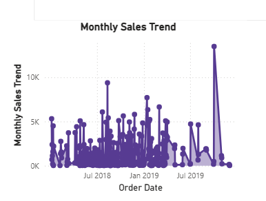
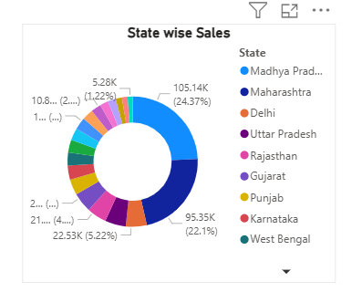
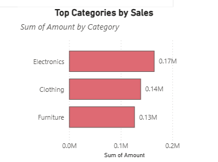
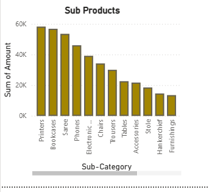
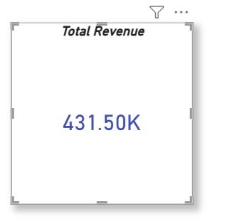
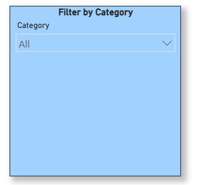

# Power BI Dashboard Project

This project was developed using Python, SQL, and Power BI for data analysis and dashboard visualization.

## Technologies Used
- Python
- SQL
- Power BI
- Pandas
- NumPy

## Features
- Data Cleaning
- SQL Integration
- Dashboard Visualization
- KPI Analysis
- Interactive Charts

## Monthly Sales Trend

## States Wise Sales

## Top Categories by Sales

## Sub Products Analysis

## Total Revenue

## Filter By Category

